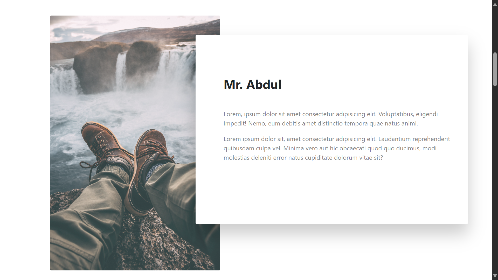
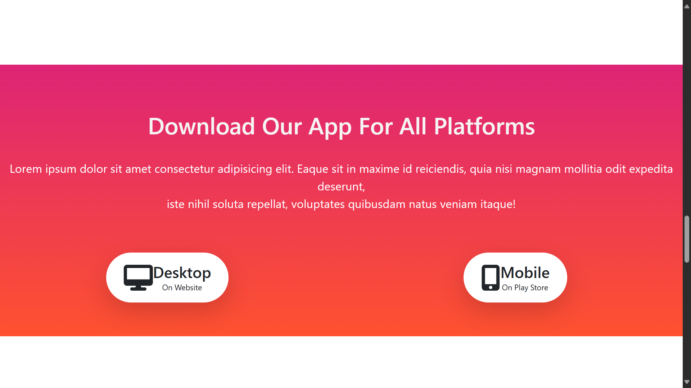

# Books

## Overview
Welcome to the Books Ordering Website! This project is a simple yet functional web application that allows users to order books online.

## Project URL  
Visit the website [here](https://books-order-now.netlify.app/).

## Screenshots

Take a look at some screenshots from the website:

## Technologies Used
- **HTML**
- **CSS**
- **Bootstrap**

## Installation and Setup
To run this project locally, follow these steps:

1. Clone the repository: git clone https://github.com/Bilal00404/Books.git
2. Navigate to the project directory: cd Books
3. Open the HTML file in your preferred browser.

## Contact
If you have any questions or suggestions, feel free to contact me at bilalchanna67@gmail.com.
